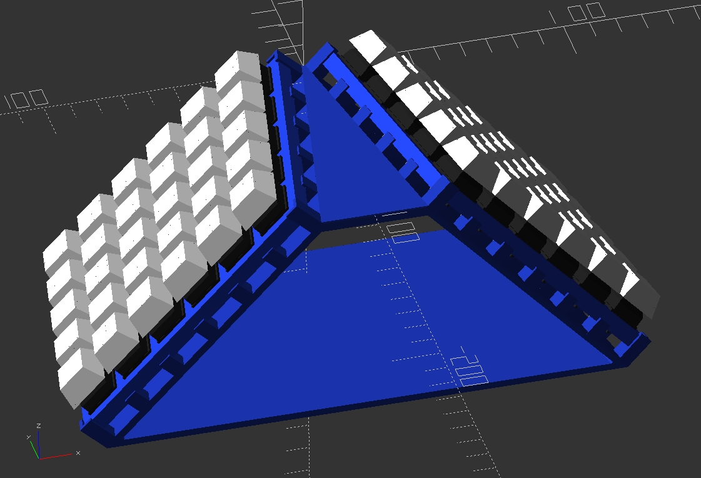
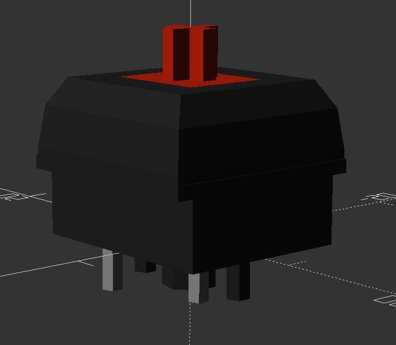
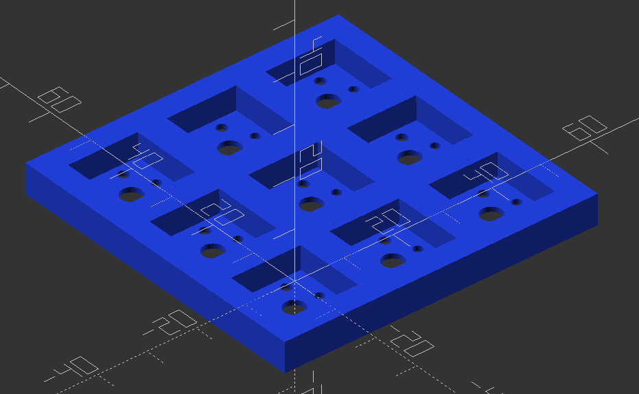
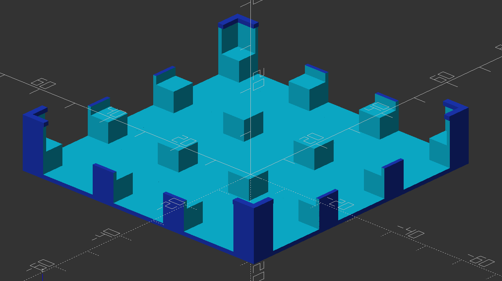
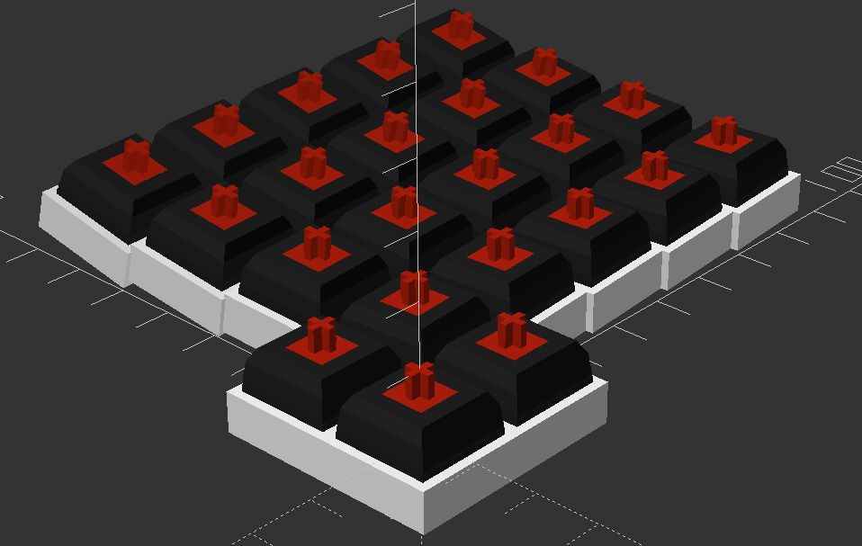

# lap-keys
A keyboard design that allows hands to naturally rest on the lap, while using

## Overview
This is a design prototype in progress for a new keyboard that will hopefully fix some ergonomic issues with my desk at home. Namely, I'm sick of keeping my hands up on a desk all day. I'd much rather let them relax on my lap while I work. Nothing I can find for commercially available (or other build-your-own) keyboard/mouse units seem to fit the bill.

## Prototypes
**Split Sixty Wedge**
- This is the first prototype I'm working on that is intended to be 'lap-friendly'. It should receive the custom PCBs I've designed to each include 5 switches in a column and a header that sticks out the top to allow for hand-wiring the key matrix between columns. This prototype is designed to be a simple 5x12 rectilinear split keyboard with each half arranged into a forward-pointing wedge. This configuration should get your wrists into a sensible orientation while typing either on a desk or your lap. It also includes a trackball, to help reduce the need for a dedicated pointing device. I'm calling this first prototype the **split sixty wedge**:

## Prints
The prints section of this repo consists of [OpenScad](https://www.openscad.org/) modules for any prototyping I'm doing and some that allow for quick definition of a keyboard with little more than the coordinates of where you want keys to be located. I've thrown together some *brain_storming* layouts with just coordinates that still produced a part that was reasonably printable, if not polished-looking. 

Some of the OpenScad modules include:

- Any prototypes I'm currently working on
- A rough mock-up of a CherryMX switch:

**Brain storming modules** that can be used for quick brain storming of layout ideas and can potentially be printed out and hand-wired:
- Sockets to fit the CherryMX switch:

- A base to hold the sockets with space underneath for wiring:

- Some utility modules that can take a set of coordinates and translate them into the start of a workable keyboard:

## Firmware
The firmware section of this repo contains MicroController Unit firmware I've designed to run on the MCU that drives the keyboard prototypes. These firmwares use the [QMK firmware](https://qmk.fm/) as their base.

## PCBs
The pcbs section of the repo contains KiCad PCB design files for any PCBs I design as part of this project

