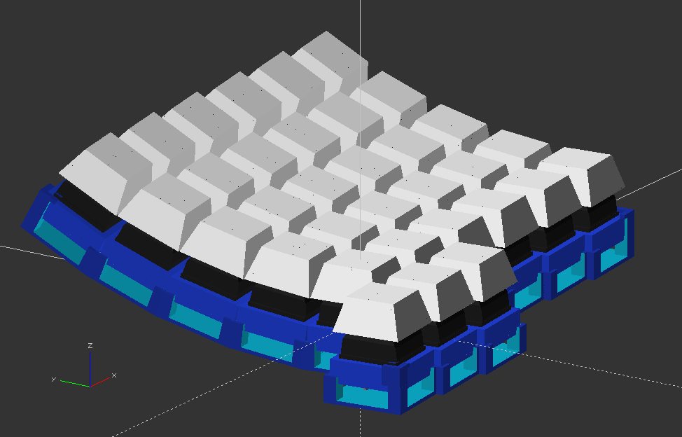

# lap-keys
A keyboard design that allows hands to naturally rest on the lap, while using

## Overview
This is a very early design concept for a new keyboard that will hopefully fix some ergonomic issues with my desk at home. Namely, I'm sick of keeping my hands up on a desk all day. I'd much rather let them relax on my lap while I work. Nothing I can find for commercially available (or other build-yourown) keyboard/mouse units seem to fit the bill.

## Progress

- Got some parts in!
- I printed up a simple 3-by-3 numpad like keyboard for learning purposes:

There are two printed parts here. The switch sockets:

and the base to hold them with space for wiring to go underneath:

Got this guy wired up to a breadboard, found and modified the configuration from a similar already-supported QMK keyboard, and loaded the firmware into the Elite-C I ordered. I now have a proof-of-concept numpad!

- Next, I'm printing up a split 5x12 ortholinear keyboard to play with a full-scale wiring set-up. After playing with the prototype 3x3 for a bit, I decided to add some corner clips to the base to hold the sockets in place:

A full 60% 5x12 board would be too big to print so I'm just treating the two halves like one piece for now, then I'll figure out how to do the split later on.

## Working concepts
These are just rough layout concepts rendered with my prototyping tools:

**Right-hand rectilinear:**

**Right-hand tilted:**

