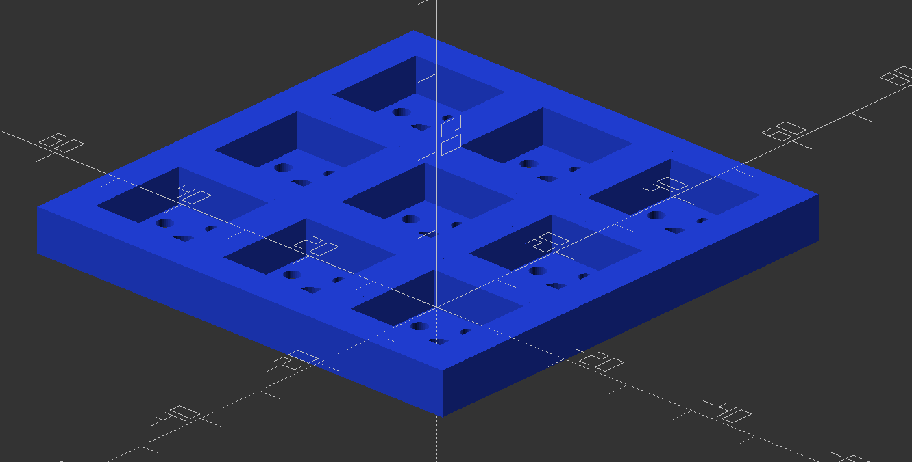
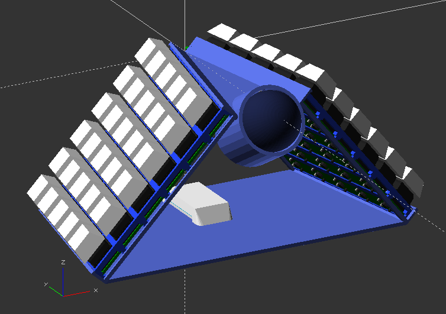

# lap-keys
A keyboard design that allows hands to naturally rest on the lap, while using

## Overview
This is a very early design concept for a new keyboard that will hopefully fix some ergonomic issues with my desk at home. Namely, I'm sick of keeping my hands up on a desk all day. I'd much rather let them relax on my lap while I work. Nothing I can find for commercially available (or other build-your-own) keyboard/mouse units seem to fit the bill.

The prints section of this repo mostly consists of OpenScad prototyping modules that allow quick definition of a keyboard with little more than the coordinates of where you want keys to be located. Most of the layouts I've thrown together with just coordinates still produced a part that was reasonably printable, if not polished-looking. The prototyping modules consist of:

- A rough mock-up of a CherryMX switch:

- Sockets to fit the switch:

- A base to hold the sockets with space underneath for wiring:

- Some utility modules that can take a set of coordinates and translate them into the start of a workable keyboard:

## Progress
- I've made a couple of keyboard configurations for my own learning and am beginning to prototype lap-friendly layouts. Since I have no idea what key layout will be ideal in the end, I started with an ortholinear 5x12 configuration, split into two halves and made a usable keymap for it:

- I'm printing the first base that is intended to be 'lap-friendly', which should receive the socket plates I already have printed, wired, and working. I'm calling this first prototype the **split sixty wedge**:

